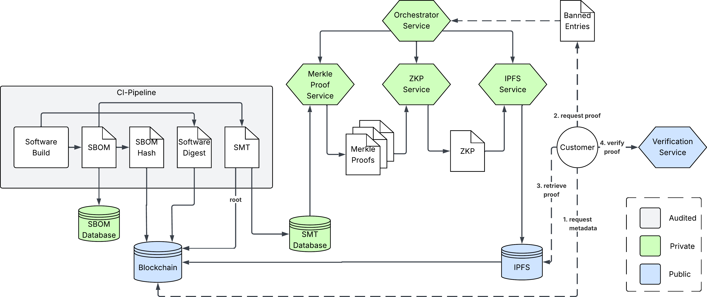

# TrustBOM

A blockchain-anchored system for privacy-preserving SBOM verification using zero-knowledge proofs.

**📚 [Full Documentation](https://tuberlin-blockchain-prototyping.github.io/trustbom-docs/docs/)**

## Overview

TrustBOM resolves the tension between software supply chain transparency and intellectual property protection. Software vendors can cryptographically prove the absence of banned dependencies (vulnerable components, restricted licenses) without revealing their complete Software Bill of Materials (SBOM).

## Architecture



The system operates in two phases:

1. **Commitment Phase (CI/CD):** Vendor builds software, generates SBOM, transforms it into an SMT, and commits the root hash to the blockchain
2. **Verification Phase (On-demand):** Customer requests proof that specific banned packages are absent; vendor generates ZK proof; customer verifies locally

### Core Services

1. **[Proof Orchestrator Service](proof-orchestrator-service/)** (Python/FastAPI)
   - Coordinates the end-to-end proof generation workflow
   - Receives customer requests with SMT root hash and banned package list
   - Manages communication between Merkle, Proving, and IPFS services

2. **[Merkle Proof Service](merkle-proof-service/)** (Go/Gin)
   - Builds Sparse Merkle Trees (depth 256) from CycloneDX SBOMs
   - Generates compressed non-membership proofs for banned packages
   - Stores SMT data in BoltDB indexed by root hash

3. **[Proving Service](proving-service/)** (Rust/RISC0)
   - Generates zkSTARK proofs using RISC Zero zkVM
   - Verifies Merkle proofs inside the guest program
   - Outputs commitment: SMT root, banned list hash, compliance status

4. **[IPFS Service](ipfs-service/)** (Python/Flask)
   - Stores generated proofs on IPFS network
   - Maintains SQLite mapping of composite hash to CID
   - Provides proof retrieval by root hash and banned list hash

5. **[Smart Contracts](contracts/)** (Solidity/Hardhat)
   - Anchors SMT root hashes with software digest and SBOM hash
   - Records proof metadata linking root hash to IPFS CID and compliance result
   - Provides immutable audit trail for non-repudiation

6. **[Verifier Service](verifier-service/)** (Rust)
   - Optional service for independent verification of ZK proofs
   - Validates proof against expected ImageID
   - Customers can use this service or verify locally with the RISC Zero verifier

## Prerequisites

- [Docker](https://docs.docker.com/get-docker/) (must be running)
- [kind](https://kind.sigs.k8s.io/docs/user/quick-start/#installation) (Kubernetes in Docker)
- [kubectl](https://kubernetes.io/docs/tasks/tools/)
- [helm](https://helm.sh/docs/intro/install/)
- git
- jq

## Quick Start

### 1. Clone and Configure

```bash
git clone https://github.com/tuberlin-blockchain-prototyping/sharing-sbom-system.git
cd sharing-sbom-system
cp .env.example .env
```

### 2. Edit .env

Fill in your GitHub credentials:

```
ABP_ACTIONS_RUNNER_APP_ID=<your-github-app-id>
ABP_ACTIONS_RUNNER_APP_INSTALLATION_ID=<your-github-app-installation-id>
PRIVATE_KEY_FILE=<path-to-private-key.pem>
```

### 3. Run Setup

```bash
./scripts/setup.sh
```

This will:
1. Create a kind cluster named `sharing-sbom-system`
2. Install ArgoCD for GitOps deployment
3. Deploy Hardhat blockchain node with smart contracts
4. Set up GitHub Actions Runner Controller

### 4. Access ArgoCD UI

```bash
kubectl port-forward svc/argocd-server -n argocd 8080:443
```

Open https://localhost:8080 (username: `admin`, password shown during setup)

## Project Team

- [@thangixd](https://github.com/thangixd)
- [@FR-SON](https://github.com/FR-SON)
- [@lawrencetom](https://github.com/lawrencetom)
- [@luccadibe](https://github.com/luccadibe)
- [@Amor216](https://github.com/Amor216)
- [@soeren227](https://github.com/soeren227)

**Supervision:** [@tawalaya](https://github.com/tawalaya), Maria C. Borges
